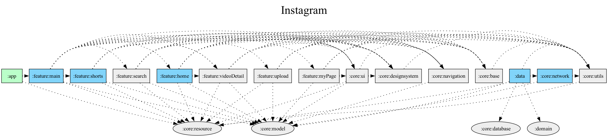
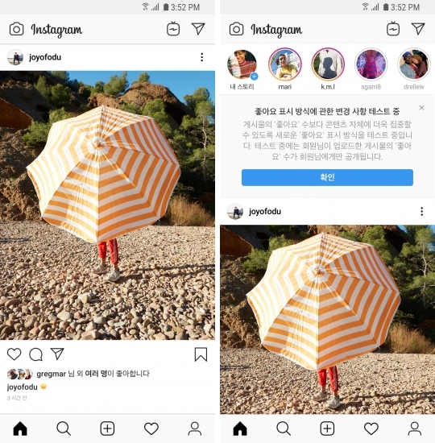
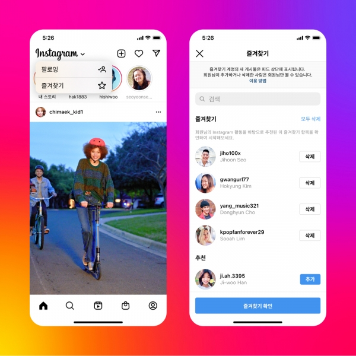

# 📺 Instagram Compose

Jetpack Compose 기반의 **인스타그램 클론 앱**입니다. 최신 안드로이드 기술 스택을 활용하여 동영상 리스트, 재생, 검색 등 핵심 기능을 구현하였습니다.

## ✨ 주요 기능
- 인기 영상 목록 조회
- 동영상 재생 (Instagram Player API)
- 검색 기능
- 채널 및 상세 정보 보기
- 다크 모드 지원

## 🧱 아키텍처
**Clean Architecture + MVI**
- Domain
- Data
- Presentation

## 🧰 기술 스택
- Jetpack Compose
- Hilt (DI)
- Retrofit + OkHttp
- Kotlin Coroutines + Flow
- Room (예정)
- Jetpack Navigation
- Coil (이미지 로딩)
- Instragram Player API
- Material3 (Design System)

## 📦 의존 그래프

  

## Screenshots

  
  

프레임별 동영상 스크린샷 생성  
brew install ffmpeg  

fps=1/5 (초당 프레임 수 / 5초의 1프레임)  
ffmpeg -i https://commondatastorage.googleapis.com/gtv-videos-bucket/sample/ForBiggerBlazes.mp4 -vf "fps=1/1" thumbnail%03d.jpg

